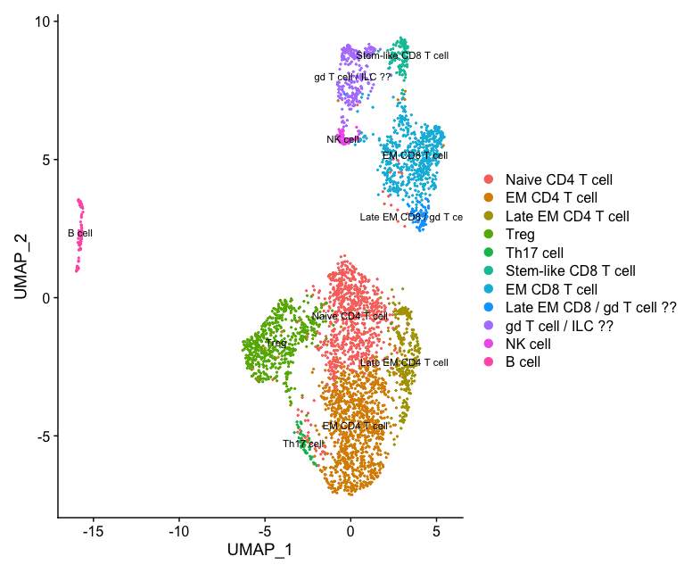
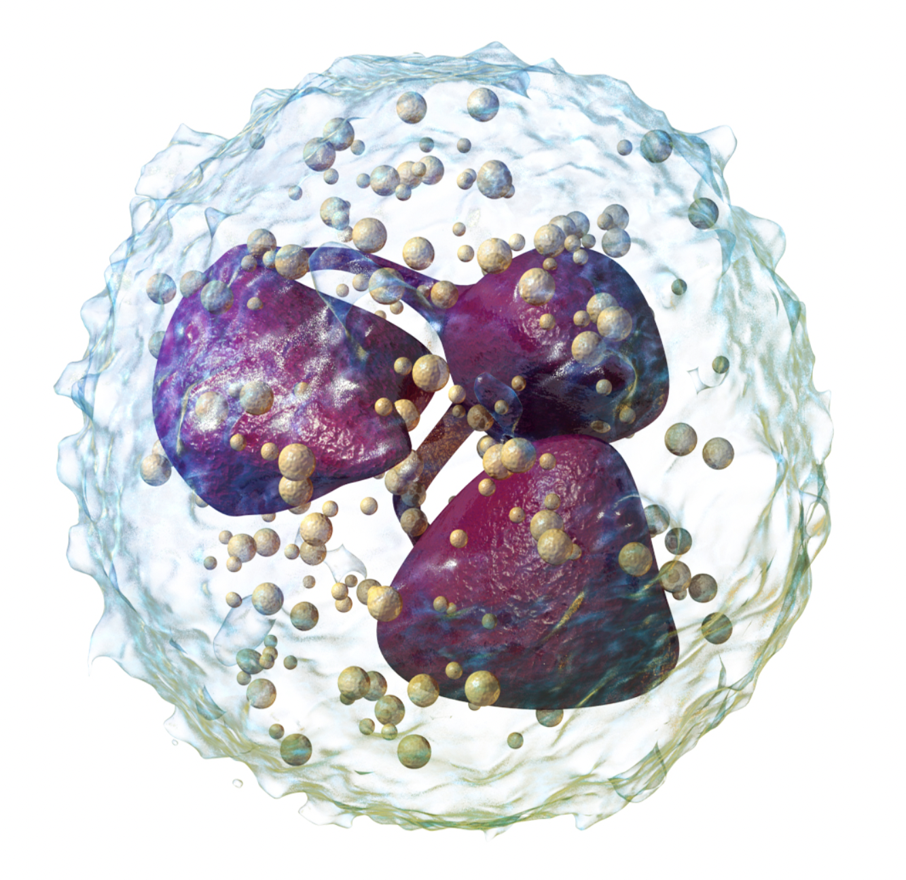

# Molecular Biology Projects

The field of molecular biology involves a LOT of data analysis! Here I share with you all a few projects I worked on and analyzed using R and Excel. I hope you find this easy to navigate and use for your own personal means of data analysis as well!

## [Project: Expanding Acne Dataset](https://github.com/tamxto/MolecularBiologyProjects/tree/f07e3bbe88f29d288ce43d77a79c74069a921433/Projects/Project_ExpandingAcneDataset)

For this project, I'm working on expanding a publicly available dataset based off a paper that compared normal vs. acne skin using single-cell RNA sequencing (scRNAseq). scRNAseq is an effective tool for analyzing genetic and molecular profiles of individual cells. This allows us to study changes in specific cell types based on the types of disease lesions. We can know which genes are differentially expressed in each cell type and each condition. In this case, we can know how gene expression differs between cell types in normal vs. acne skin lesions. It's a powerful way for elucidating unknown pathogeneses and identifying potential targets for therapeutics.

The publicly available data can be found [here](https://github.com/modlab246/scRNAacne).

The paper I'm referencing is cited here: Tran H. Do et al. ,TREM2 macrophages induced by human lipids drive inflammation in acne lesions.Sci. Immunol.7,eabo2787(2022).DOI:10.1126/sciimmunol.abo2787.

Do, Tran H. et al. already did quality control and integrated the data, but my goal is to expand the lymphocyte dataset.

Originally, the authors named 5 cell clusters in this dataset, however, I plan to figure out if we can expand it into more cell types so that the data is more specific for generating hypotheses (as shown below). This will allow researchers to more specifically narrow down where a gene of interest is being expressed. After expanding the dataset, I plan to analyze the single cell data in through different graphical representations (shown in the next project).

 

## Project: Graphical Analysis of New Acne Dataset

This project utilizes the newly expanded lymphocyte dataset constructed from the "Expanding Acne Dataset" project. 

In this project, I demonstrate how to use various packages and generate different types of visual analyses such as dot plots, violin plots, bar plots, etc. Furthermore, I include other methods of analysis with single cell data such as gene ontology (EnrichR included), subsetting, pseudotime, etc. 

These are fundamental packages to understand how we can analyze single cell sequencing data. It's definitely very powerful!

## Project: Proteomics Analysis from Mass Spectrometry Data

Outside of using Seurat and analyzing single cell, you can analyze other molecular biology data (in this case, we are looking at proteomics data). 

This data holds dear to me because it's something that I created in the lab--starting with the question, then hypothesis, experimental design, troubleshooting, sample prep, and finally obtaining the data to analyze. It's awesome to see wet lab techniques colliding with dry lab. This is what makes science so cool!

